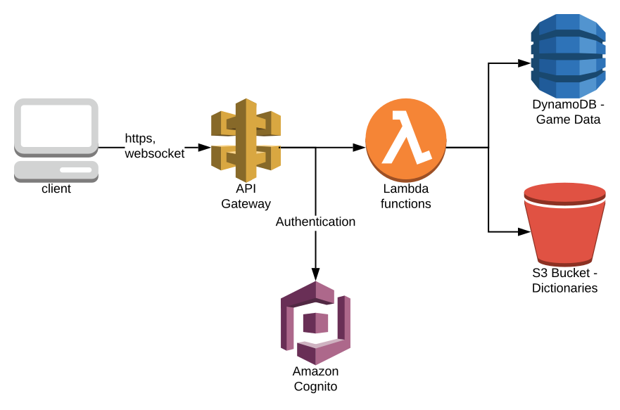

# Micah and Melissa's Word Game

Because the official online version of Scrabble is full of ads and popups and irritation, I decided to make my own, to keep my programming chops up and just for fun.

In doing it, I decided to explore a few things I hadn't had direct experience with before:

- React for the front end
- AWS for the back end, managed via [serverless](https://serverless.com/)
- Typescript

The idea is to run this as cheaply as I can. (At this point I haven't been charged yet, but some of the free tiers are only for a year, so if I keep everything up it will start charging miniscule amounts of money.)

At this point it does most of what I set out to have it do, and I'm pretty much done with it. The following are some notes on what I ended up with, and what I thought about while doing it.

# How It's Deployed

If you run `yarn ci-build` from the root, it'll try to do everything described below, after running the tests.  It'll look for AWS credentials in your environment for the server piece.

To actually serve the front-end I'm using [render.com](https://render.com/) which serves static sites for free with SSL on your own domain.  I like free.  It will actually run your build script for you, which has enabled me to (ab)use that as a "poor man's CI"--I have the `yarn ci-build` command mentioned above run tests before building, and if that fails the build will fail.

### While developing/to deploy pieces:

For the back-end you can do `yarn deploy` from the `packages/server` directory to deploy the back-end.  You'll need to upload a word list using `packages/server/scripts/uploadWordList.ts` (just look on google for a scrabble word list).

Then you can run `packages/server/scripts/extractStackOutputs.ts`, and either build the client using `yarn build` or start it in dev mode using `yarn start` from `packages/client`.

# The Game

So the game is Scrabble.  I haven't modified the rules from the board game edition.  I feel no need to describe or introduce the game here - it's familiar to most Americans...not sure how popular it is elsewhere, but it has other language editions.

Since this is intended to be set up and run for a small group, there are features missing that would be needed if it were open for the whole world.

I would describe the overall UI as "works enough not to get in the way"--it isn't pretty, but hopefully it's clear enough what's going on.  At least my wife understood it.

## Registering Players

There's no way to register yourself or someone else.  To add a player, I go to the AWS Console and add them myself in the Cognito user pool 😜.  Hey, if I'm going to use a service I'll take advantage of it.

## Starting Games

You enter who you're playing with (you have to choose someone already registered) and click the button and...the game is started.  For a public game you'd probably want to have all the players agree to join before the game starts, but...no need when all registered users live in the same apartment.

Also there's no way to stop/quit a game until it's over.  Would need that at some point.

I had originally intended to add in variants like Super Scrabble and UpWords, or support for playing in other languages.  But I never got around to finishing that.  You see some vestiges of intending to support that in the code...but I never actually tried to make it work.

## Playing

The board pretty much works fine on the browsers I've tried it on, which are Chrome, Safari and Firefox on our Mac laptops.

It sort-of-kind-of works on iOS and Android--the board doesn't zoom in and out, and the dragging tries to scroll in an awkward way when you pick up a piece from the tray.  You have to hold down the piece in your tray to initiate a drag, which is annoying and shouldn't be needed.

For the board itself I did try to give it a look to reproduce the look of an actual scrabble board.  (Elsewhere, for the controls and everything around it, I've made no effort to be visually consistent or appealing whatsoever.)

One feature I added, since I kept wanting it while playing the official version: in addition to dragging the tiles, you can click on an empty square on the board to set a directional "cursor" then type to add letters from your tray.

The layout of the scoreboard and stuff at the top looks really goofy but hey - it works well enough.

## Things I would like to have done but didn't

There are no pop-up notifications or anything to alert you when it's your turn.  If you're looking at the game it'll automatically update the screen, but that's all it'll do.  It'd be better if it used notifications to say when it's your turn, or something along those lines.  I might care more about this if I weren't playing with someone sititng in the same room.

If the page is smaller than the board, you can scroll the board but you can't zoom it in and out.  That's especially annoying on mobile.

# The Tech

## Overall Approach

The idea is to have a core that's able to validate and score game moves, which is usable on the client (so that you can see what score a move would give--also lets the local demo work) as well as on the back end for actual multi-player play.

Code is divided into subfolders that each exist as their own node packages:

- [client](packages/client) - A [Create React App](https://facebook.github.io/create-react-app/) app (unfortunately I had to hack it up with [rescripts](https:// github.com/harrysolovay/rescripts) to make it play nice with my single-repo setup. I would never do that with a "real" project, but it works fine for me here.)
- [server](packages/server) - Runs on the server(less) - the APIs that the client can hit.
- [common](packages/common) - The "logic" code used in both server and client

It's a single repo set up with yarn workspaces.

## Common - The Scrabble Game Model

This is where there's an API that models a scrabble game.  It's all based on immutable structures representing the state of the game.  The key idea is that there is a `CommonKnowledgeGameState` which represents the parts of the game that are visible to all players, which can be extended to either a `PlayerVisibleGameState` (the game as visible to one player, which includes their own tray only) or a complete `GameState` which includes the trays of all players, and the remaining letters left in the bag.

The game is played by calling functions that take a game state and a move, which can check the move for legality and return either a reason why the move isn't legal, or a new game state after the move is performed.

This has its own unit tests, and is used throughout the client and server code.

## Front End - React, Create-React-App and Friends

So this is my first time creating something with React.  I really like the execution model--much better than what I remember in GUIs back when I wrote them a lot (.NET winforms, simple HTML forms and a bit of ExtJS--it was a while ago).  Everything here is a function using hooks, which work great.  I was starting to play around with this when hooks had just came out.

I haven't used Redux, or any other state management library.  Hasn't seemed necessary yet.  Either this is too small a project to have the problems those are meant to solve, or hooks have made them unncessary.

All the game updates, both moves and game state updates, are sent over a web socket.

The drag and drop works as well as it does because of [react-beautiful-dnd](https://github.com/atlassian/react-beautiful-dnd).  It does exactly what I want (except I wish there was a way to tell it to start dragging with no delay on mobile...)

I'm fairly happy with the ability to test things here using [react-testing-library](https://github.com/testing-library/react-testing-library).

Some weird stuff that I wouldn't be doing if this were a "serious" project:

  * I'm monkey-patching create-react-app with [rescripts](https://github.com/harrysolovay/rescripts).  That totally voids the warranty - but I didn't see how else to get it to automatically reload code from the "common" package upwards in the mono-repo.  There's no official support in create-react-app for this, as far as I can see.
  * Since I was hacking it up anyway, I put an eslint configuration in the root so I could apply changes across the monorepo.

## Back End, Serverless

So, the back end is "serverless" which means wiring up AWS services to make things happen without explicitly managing any server instances.

I found the [serverless.com](https://serverless.com/) framework useful for this.  I feel like now that I've done this once, I could try putting the components together myself without it - but when getting started it was very helpful to have an opinionated way to do it without getting lost.

At the core what I'm doing is fairly simple.  The client connects to API Gateway, which validates the user against Cognito, then lets you get or create a game.  To actually play a game, you connect to a WebSocket via [API Gateway's WebSocket support](https://docs.aws.amazon.com/en_pv/apigateway/latest/developerguide/apigateway-websocket-api-overview.html).

There are a few scripts under `scipts` that are intended to be run with [ts-node](https://github.com/TypeStrong/ts-node):
  * `cleanDBWSConnections.ts`: clean out old websocket connections that didn't get removed because API Gateway didn't call the disconnect handler.  How do actual production uses of this handle this?
  * `extractStackOutputs.ts`: After an environment is deployed, extract the identifiers needed for the front end to find the back end.  This gets used in the overall build script for deploying.

### Serverless.com framework: 👍

The serverless.com framework is handy, but it's one of those things that automates more than it abstracts.  It saves you from typing, but not from having to understand what it did for you.

### Cognito: 👎👎🤬
I would _not_ use Cognito again for anything, because:
  * You can't migrate users out of cognito, even to another cognito instance.  And there are important settings - the required attributes of each user, in particular - that can only be set at user pool creation.  Hope you have perfect foresight and never change your mind!
  * There are choices made by default that drive me crazy - for instane, it's got instructions int the documentation for how to use email addresses for user IDs.  It doesn't warn you that it still treats that email address as _case sensitive_.  Nothing like that sinking feeling where you're first non-dev user (my wife) can't log in because she likes to capitalize her name in her email address.  And there is no way to even change it!

### API Gateway Websockets

On the one hand, it's great that it's here and works!  Not sure I'd have even got the game playing if it weren't for that.  On the other hand, there's a few oddities I noticed in how it works:

  * There's no way to see what connections are open.  When a connection is opened, it gives you an ID and you have to persist a record of it in your own data store.  Then you can send messages back using the ID.  It'd be great  
  * Occasionally a connection that I dropped won't have its disconnect handler called.  This results in a stale record sticking around in the database of a connection.
  * There's no way out of the box to have a websocket check that the connection is coming from a logged in user, like there is for ordinary service calls.  I ended up copy-pasting and adapting from [here](https://github.com/pianosnake/verify-cognito-token/blob/master/index.js) and I can't say I fully understand each line - I just got it to work.  I think.

### No Tests On The Back End...Doh!

One major missing piece in the "server" section is that I don't have any tests.  The reason for this is that most of what this code has to do is not the code I wrote.  My code is all either calling into the common library (which _is_ tested), saving and retrieving from DynamoDB (available to run locally, but difficult to set up.)  A lot of the "functionality" I'd want to test is configured rather than coded.  The services look to Cognito to authenticate the logged in user with a line of config in serverless.yml; that's great, but there's no way to locally test that (there's no local version of Cognito that I've seen--at least not for free.)  So I would have to create a way to do automated integration tests, that spin up the whole setup on my real AWS account, to do any worthwhile testing here.  And, y'know, I guess I could have done that.  But I didn't bother.

## Miscellaneous Tech Notes

- Yarn Workspaces: mostly works, but it's annoying that "yarn upgrade" won't update the package.json files. I put a script in there to use [syncyarnlock](https://www.npmjs.com/package/syncyarnlock) across the packages, but this is something that really should just work.

## Credits

- Favicon by barkerbaggies from [IconArchive](http://www.iconarchive.com/show/bag-o-tiles-icons-by-barkerbaggies/M-icon.html)
